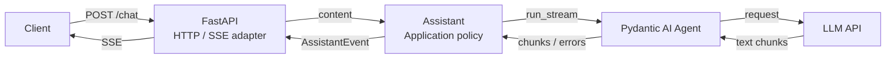

# Hello My Assistant

[](https://www.python.org/) [](https://fastapi.tiangolo.com/) [](https://ai.pydantic.dev/)<br>
[](https://logfire.pydantic.dev/) [](https://opentelemetry.io/) [](https://docs.astral.sh/uv/)

AI 에이전트 서비스를 직접 설계하고 구현하며, 신뢰할 수 있는 서비스로 발전시키는 데 필요한 엔지니어링 역량을 단계적으로 쌓아가는 프로젝트입니다.

## 프로젝트 동기

AI 에이전트 서비스에는 모델뿐 아니라 Tools, Memory, Context, Evaluation과 이를 사용자에게 제공하기 위한 서비스 아키텍처 등 다양한 기술이 함께 사용됩니다. 각각의 개념을 개별적으로 학습하는 것만으로는 이들이 실제 서비스에서 어떻게 연결되고 어떤 설계 문제가 발생하는지 이해하기 어렵다고 생각했습니다.

이 프로젝트는 하나의 AI 에이전트 서비스를 처음부터 직접 만들어가며, 필요한 기술을 발견하고 실제 코드에 적용해보는 과정입니다. 사용자에게 서비스를 제공하는 계층부터 내부 Agent의 실행과 오케스트레이션까지 단계적으로 확장하며 AI 에이전트 서비스 엔지니어링 전반을 이해하는 것을 목표로 합니다.

## 진행 상황

- **현재** — 단일 요청 LLM 응답 스트리밍, 실패 처리, 실행 관측
- **다음** — Tool calling과 Agent 동작 평가
- **이후** — 대화 상태와 Memory, 외부 지식 활용

## 아키텍처



자세한 설계는 [API Architecture](docs/design/api-architecture.md)를 참고하세요.

## 시작하기

### 요구 사항

- Python 3.14
- [uv](https://docs.astral.sh/uv/)
- OpenAI-compatible LLM API

### API

```shell
cd apps/api
uv sync
```

`apps/api/.env` 파일을 생성하고 다음 값을 설정합니다.

```dotenv
LLM_BASE_URL=<provider-base-url>
LLM_MODEL_NAME=<model-name>
LLM_API_KEY=<api-key>
CHAT_TIMEOUT_SECONDS=60
```

API 서버를 실행합니다.

```shell
uv run fastapi dev src/hello_my_assistant_api/main.py
```

### CLI

API 서버가 실행된 상태에서 별도의 터미널을 엽니다.

```shell
cd apps/cli
uv sync
uv run python -m hello_my_assistant_cli.main
```

CLI는 API의 스트리밍 동작을 로컬에서 확인하기 위한 클라이언트입니다.

## 검증

API:

```shell
cd apps/api
uv run pytest
uv run ruff check .
uv run mypy
```

CLI:

```shell
cd apps/cli
uv run pytest
uv run ruff check .
uv run mypy
```

## 관련 문서

- [API Architecture](docs/design/api-architecture.md)
- [Domain Language](CONTEXT.md)
